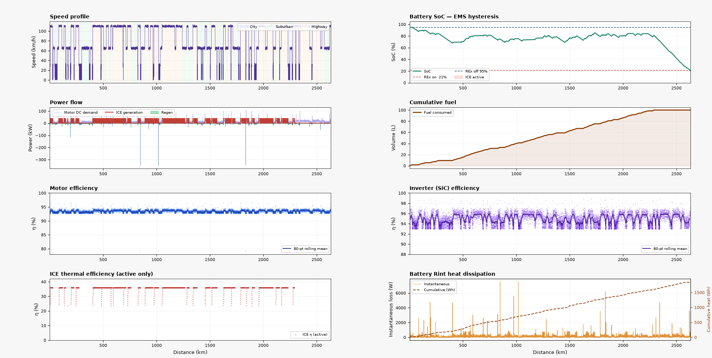

# HyCar
Simple THC (True Hybrid Car) Simulation

This repository contains a hybrid vehicle energy management simulation and a PPO-based reinforcement learning training workflow.

## Quick start (Conda)

1. Create the environment from the provided `environment.yml`:

```bash
conda env create -f environment.yml
```

2. Activate the environment (replace `hycar` with the actual environment name if it differs):

```bash
conda activate hycar
```

3. Run the PPO training script:

```bash
python train.py
```

Notes:
- Training logs and model checkpoints are stored in `ppo_logs/`.
- The project uses `stable_baselines3` PPO with a vectorized environment and evaluation callback.

## Agent process description

The reinforcement learning agent is implemented in `lib/RLagent/agent.py` as `HybridVehicleEnv`.

Key components:
- `action_space`: 2 discrete actions
  - `0` = electric-only operation
  - `1` = turn on the internal combustion engine (ICE) to recharge the battery
- `observation_space`: a normalized 6-element vector
  - distance progress
  - battery state of charge (SoC)
  - fuel level
  - speed
  - acceleration
  - ICE warmup state

Per step, the environment does:
1. advance the stochastic drive cycle and update speed/acceleration
2. compute road load power demand for the vehicle
3. route demand through the electric motor, including regeneration when braking
4. convert motor power through the inverter
5. apply the chosen ICE action and simulate fuel burn if the engine is running
6. update the battery state with net DC bus power
7. compute reward and episode termination

The reward is currently based on progress along the route, favoring distance traveled while the battery and ICE states are managed safely. The episode ends if the battery SoC drops below the minimum threshold or if fuel is exhausted without sufficient electric reserve.

The `render()` method produces a multi-panel performance plot showing speed, SoC, power flow, fuel consumption, efficiencies, and battery heat.

## Example result

Below is the provided training result image.



## Notes

- If you want to evaluate or simulate a trained policy, review `simulate.py`.
- The agent and environment can be extended by adjusting the hybrid system component parameters in `lib/settings.py`.

License: see `LICENSE`.

